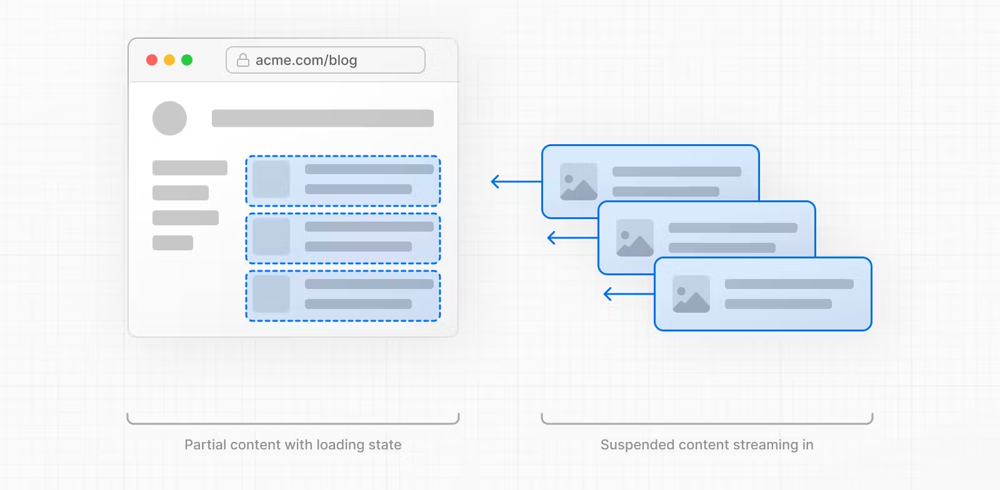

## 文件系统路由

Next.js定义了一套基于文件系统的路由。简单来说就是，`app`文件夹下面的文件夹的名称就是路由参数，而每个文件夹中的`page.js`中的内容就是该路由下的内容。

省去了像`Vue React`一类的框架需要单独定义路由文件的麻烦，Next.js直接采用文件系统路由，需要新的路由页面时直接新建一个文件夹即可。

## Layout和Page

每个路由文件夹下都需要有一个`page.js`文件用于展示该路由对应的内容。路由跳转时，实际上是展示不同文件夹下`page.js`的内容。

每个文件夹下还可以定义一个`layout.js`文件。和`page.js`不同，`layout.js`在当前路由的二级路由下进行切换时始终保持不变，所以它一般会用来展示一些跨路由共享的静态资源。
比如在`/dashboard/setting`和`/dashboard/invoice`之间跳转，`dashboard`目录下的`layout.js`会在两个路由之间共享。
默认情况下`page.js`中的内容会被嵌入`layout.js`中，`app`目录下的`layout.js`必须要定义`<html> <body>`因为Next.js不会自动生成。


## 链接和跳转

Next.js中进行路由跳转经常使用内置的`<Link>`组件和`useRouter`钩子。

### 使用方式

```tsx
// Link组件
import Link from 'next/link'
 
export default function Page() {
  return <Link href="/dashboard">Dashboard</Link>
}

// useRouter
import { useRouter } from 'next/navigation'

const router = useRouter()

router.push('/dashboard', { scroll: false })
```
两种方式都可以进行路由跳转，`<Link>`最终会被渲染为`<a>`。因为`useRouter`钩子只能在客户端组件中使用，**因此官方推荐非必要情况尽量使用`<Link>`进行路由跳转。**

### 相比直接进行跳转的优点

1. 数据预请求。页面首次加载时，Next.js会在路由被用户使用之前就预先请求路由对应的数据，提升用户体验。（仅能在生产模式下开启，使用`<Link prefetch=false>`可以关闭）
2. 缓存。Next.js会缓存路由数据，避免引起过多的网络请求。
3. 部分渲染。路由跳转时仅会重新渲染变化部分。

4. 阻止浏览器默认行为。Next.js会阻止浏览器在进行路由跳转时的页面全部重载行为，减少性能消耗。
5. 缓存向前和向后跳转时页面的滚动位置。

## Route Group

将拥有近似逻辑或者需要使用同一个layout的路由组织到同一个文件下同时又不影响路由参数。


也可直接在根目录下定义，此时每个`layout.js`都需要添加`<html> <body>`。

## 动态路由

Next.js使用`[]`来定义动态路由。比如动态路由的参数是一个id，则在定义文件系统路由的时候，对应的文件夹应该被命名为`[id]`，此时Next.js会将id视为一个需要动态传入的路由参数。
在`[id]`文件夹下的`page.js`可以接受到动态路由传递的参数，进而进行页面渲染。
```tsx
// app/blog/[id]/page.tsx
export default function Page({ params }: { params: { id: string } }) {
  return <div>My Post: {params.id}</div>
}
```

还可以使用`[...folder]`和`[[...folder]]`这样的方式来匹配所有的路由。

举个例子。`app/shop/[...slug]/page.js`可以匹配`/shop/clothes`， `/shop/clothes/tops`， `/shop/clothes/tops/t-shirts`。
`app/shop/[[...slug]]/page.js`除了可以匹配单括号时的所有路由之外，还可以匹配`/shop`。

## 加载界面和流式传输

使用`loading.js`在页面还在加载时向用户展示临时内容。

在同一个目录下，定义一个和`page.js`同级的`loading.js`文件。当页面真正的内容还在加载渲染的时候，可以先向用户展示`loading.js`中的内容以提供良好的用户体验。
其原理如下：
```tsx
<Layout>
    <Header />
    <SideNav />
    <Suspense fallback={<Loading />}>
        <Page />
    </Suspense>
</Layout>
```

流式传输(Streaming)的出现是为了解决SSR的限制，先来看一看SSR如何呈现页面。

1. 在服务端请求页面数据。
2. 生成页面对应的HTML字符串。
3. 将HTML字符串以及CSS，JS资源发送给客户端。
4. 客户端现根据HTML字符串生成一个没有交互功能的静态页面。
5. 执行hydration，给页面添加交互功能。

传统SSR的问题在于，**上述每一个步骤都是串行并且阻塞的，必须等待前一个步骤执行完毕，后一个步骤才能执行**。这会明显增加首页白屏时间以及页面可以开始进行交互的时间。

Streaming区别在于将整个页面分割成一个个单独的`chunk`，每一个`chunk`都可以单独执行上面5个步骤，**而每一个`chunk`不会相互影响**。这意味着资源率先加载完成的`chunk`可以优先进行渲染和
hydration，并且和用户进行交互。即使页面的其他`chunk`仍然在加载过程中。一个组件就可以视为一个`chunk`。

使用Streaming的方法仍然是使用`<Suspense>`对组件进行包裹。
```tsx
import { Suspense } from 'react'
import { PostFeed, Weather } from './Components'
 
export default function Posts() {
  return (
    <section>
      <Suspense fallback={<p>Loading feed...</p>}>
        <PostFeed />
      </Suspense>
      <Suspense fallback={<p>Loading weather...</p>}>
        <Weather />
      </Suspense>
    </section>
  )
}
```
几张图片解释了传统SSR和Stream的区别。

使用传统SSR加载页面:


使用Streaming加载页面:



## 错误处理

使用`error.js`处理错误。

页面出现加载错误的时候，可以使用`error.js`提供更加友好的错误提示，`error.js`和`layout.js`处于同一级目录下，`page`中的错误都可以被捕获到，但是`layout.js`自身的加载错误需要使用上一级目录的
`error.js`来捕获。如果是根目录下的`layout.js`则需要使用`global-error.js`来捕获。

一个标准的`error.js`示例：
```tsx
'use client' // Error components must be Client Components
 
import { useEffect } from 'react'
 
export default function Error({
  error,
  reset,
}: {
  error: Error & { digest?: string }
  reset: () => void
}) {
  useEffect(() => {
    // Log the error to an error reporting service
    console.error(error)
  }, [error])
 
  return (
    <div>
      <h2>Something went wrong!</h2>
      <button
        onClick={
          // Attempt to recover by trying to re-render the segment
          () => reset()
        }
      >
        Try again
      </button>
    </div>
  )
}
```

## 并行路由

并行路由可以在同一个页面中加载属于不同路由的组件。使用方式如图：


使用`@`开头来命名文件夹，这样的命名方式不会影响到URL。使用这种方式命名的路由文件组件会被当做props自动传递给最近一级父级目录下的`layout.js`。具体使用代码：
```tsx
export default function Layout(props: {
  children: React.ReactNode
  analytics: React.ReactNode
  team: React.ReactNode
}) {
  return (
    <>
      {props.children}
      {props.team}
      {props.analytics}
    </>
  )
}
```

## Route Handler

在`/app/api`目录下定义`route.js`文件可以进行个性化的请求处理。

Next.js能被称为全栈框架，自然可以处理后端逻辑。以常用的axios为例子，在项目中可以使用`axios.get('/api/login')`的方式进行请求，请求会到达`/app/api/login`目录下的`route.js`文件，
在这个文件中可以进行请求的处理并返回数据。常见的连接并操作数据库，修改Cookie、Header等操作都可以在`route.js`中进行。这为前端开发者提供了一种相当简单的熟悉前后端交互的方式。只需要简单的两步就可以
实现最基本的前后端数据交互。

1. 在页面中使用`axios`这样的请求工具请求对应的URL。
2. 根据对应的URL参数，在`api`目录下书写对应的`route`文件来处理请求并返回数据。

一个常见的`route`文件内容如下：
```ts
import { NextResponse } from 'next/server'
import bcrypt from 'bcrypt'

import prisma from '@/app/libs/prismadb'

export async function POST(request: Request) {
    // request.json可以读取到请求body中的内容
	const body = await request.json()
    
	const { email, name, password } = body
	const hashedPassword = await bcrypt.hash(password, 12)
	const user = await prisma.user.create({
		data: {
			email,
			name,
			hashedPassword
		}
	})
    // 将需要返回的数据通过NextResponse.json进行返回
	return NextResponse.json(user)
}
```
动态路由参数也可以进行处理，比如请求`axios.get(`/api/${slug}`)`，slug参数是动态参数。则在api目录下新建文件夹名为`[slug]`，内部定义`route.js`：
```ts
export async function GET(
  request: Request,
  // 接收并处理动态参数
  { params }: { params: { slug: string } }
) {
  const slug = params.slug // 'a', 'b', or 'c'
}
```
此外，Next.js还提供了对于Cookie和Header的简单访问方法：
```ts
import { cookies, headers } from 'next/headers'
 
export async function GET(request: Request) {
  const cookieStore = cookies()
  const headerList = headers()
  const referer = headersList.get('referer')
  const token = cookieStore.get('token')
 
  return new Response('Hello, Next.js!', {
    status: 200,
    headers: { 'Set-Cookie': `token=${token.value}`, referer: referer },
  })
}
```

## 项目结构

Next.js并没有一种标准的项目组织结构。

个人习惯app目录下的文件专门用于路由分割，在app同级目录下建立`_[foldername]`来管理如项目组件，数据处理工具，可复用hook等。另一种比较推荐的方式就是将所有的项目文件都放在app目录下。
