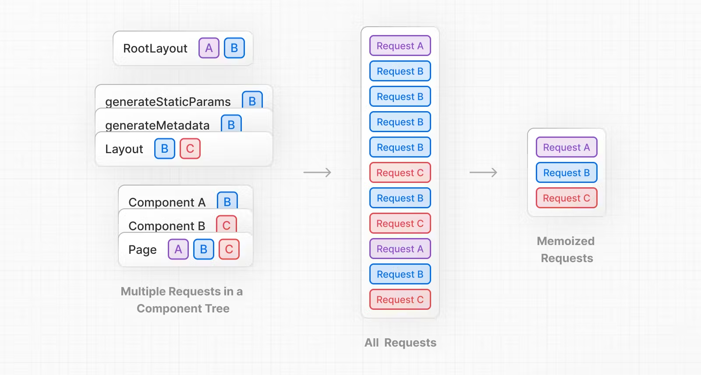

为了提高页面的性能，减少资源消耗，Next.js会尽可能多的对页面数据进行缓存，在客户端和服务端都会进行缓存，以下是几种缓存策略。

## Request Memorization

Next.js推荐在需要数据的地方请求数据，而不是在父组件中请求数据然后传递给子组件。看起来前者会引起更多的重复请求而导致页面性能下降，但是Next.js采用React的Request Memoization解决了这个问题。
简单来说，在页面渲染的过程中，如果多次请求了同一个接口，最终只会有一个请求引起服务端的数据库操作，操作的结果会被缓存在服务端。
即第一个请求会执行正常流程，服务端会访问数据库获取请求需要的数据并返回，这个返回的结果会被缓存，下次再请求同样的接口时返回的就是缓存数据，而不需要再访问数据库。如下如所示：


Request Memoization的存在提供了更加符合开发者习惯的便利，**在需要数据的地方请求数据**，同时又不用担心由于多次重复请求导致的性能问题。如果不想使用这个特性，可使用下面的方式编写`fetch`请求。

```ts
const { signal } = new AbortController()
fetch(url, { signal })
```

两点注意事项：

1. 该特性仅在使用`fecth`方法进行`GET`类型的请求时才会生效。
2. 只有在React的组件树中才会生效。

## Data Cache

Data Cache是一种在服务端缓存数据的机制，目的是减少到达数据源（比如数据库）的请求数量。下图是Data Cache的工作原理:


虽然Request Memoization和Data Cache都是通过利用缓存数据来减少请求数量的，但是Request Memoization是通过缓存请求函数的返回结果的，这只会在请求期间持续。
而Data Cache的生命周期是持续于应用部署期间的，它减少的是对于数据源的访问次数。

使用以下方式可以绕过Data Cache
```ts
fetch('url', {cache: 'no-store'})
```

## Full Route Cache

Full Route Cache发生在Next.js进行页面渲染的过程，主要是将生成的HTML和RSC Payload缓存在服务端。回顾一下Next.js的渲染流程：

1. Next.js将React Server Component转换为一种特殊的数据形式RSC Payload。
2. 结合RSC Payload和客户端JS，在服务端生成页面的HTML。
3. 将HTML和RSC Payload发往客户端，用户会立刻看到一个不具备交互功能的静态页面。
4. RSC Payload协调客户端和服务端组件树，更新DOM。
5. 执行hydration流程，让页面具备交互能力。

Full Route Cache发生在第2步到第3步之间。在生成页面HTML和RSC Payload之后，Next.js会将两者缓存在服务端，这样当用户下一次访问该页面或者其他用户访问这个页面的时候，
直接将缓存的HTML和RSC Payload发送给客户端即可，能够节省1，2两步所花费的时间。

**注意，Full Route Cache仅针对静态渲染的页面生效，对于使用了类似`cookies()`,`headers()`的动态函数或者`export const dynamic = 'force-dynamic'`这样的动态渲染命令的页面而言并不生效。**
因为这些页面出于某些原因需要将实时数据展示给用户，所以每次请求都会重新进行构建，以确保页面展示的数据出于最新状态。

## Router Cache

Router Cache是一项在客户端的缓存策略，维持用户会话期间的页面数据，缓存的数据就是RSC Payload。

一个常见的场景，用户会经常在页面中进行路由的跳转，主要是前进和后退，用户每一次前进和后退都向服务端请求数据会造成极大的性能浪费。所以Next.js对于用户访问过的路由都会进行缓存，这个缓存是客户端缓存，
**无论是静态还是动态页面，Router Cache都会生效**，这是和Full Route Cache最大的不同点。
