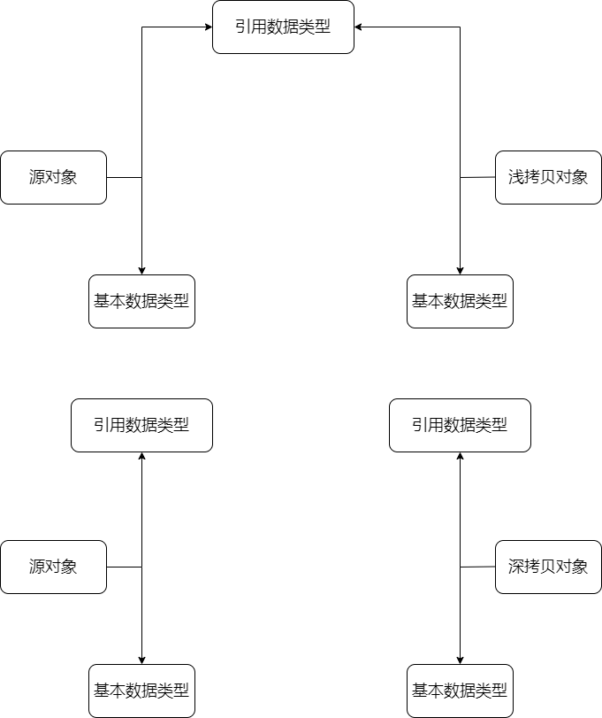

一张图解释深拷贝和拷贝的区别：



简单来说。深拷贝会完全拷贝整个对象并开辟单独的内存空间来存储新对象，新对象和源对象之间没有任何关系，两者各自的变化也不会反映到对方身上。浅拷贝则是只会为基本类型的数据（Number String Boolean）开辟单独的内存空间，对于对象内部属性值为引用数据类型的数据而言，实际上是在拷贝对象中添加了一个新的引用。浅拷贝对象中引用数据类型的值的变化会反映到对方身上，因为它们本质上是对同一块内存空间的引用。

## 浅拷贝实现

浅拷贝的实现非常简单，只需要新建一个对象并且遍历源对象中的属性，在新对象中创建这些属性并直接赋值即可。

```js
function shallowClone(target) {
    // 区分是对象还是数组
    let clone = Array.isArray(target) ? [] : {}
  
    // 遍历属性，寻找属于对象自身的属性
    for (const key in target) {
        if (target.hasOwnProperty(key)) {
            clone[key] = target[key]
        }
    }
  
    return clone
}
```

## 深拷贝实现

深拷贝的实现其实非常简单，就是浅拷贝加递归。在发现对象中某个属性的值是引用类型的数据的时候，再对这个引用数据类型进行浅拷贝的逻辑。由此可以得出第一版的代码：

```js
function deepClone(target) {
    let clone = Array.isArray(target) ? [] : {}
  
    for (const key in target) {
        if (target.hasOwnProperty(key)) {
            if (typeof target[key] === 'object') {
                clone[key] = deepClone(target[key])
            } else {
                clone[key] = target[key]
            }
        }
    }
  
    return clone
}
```

但是这个版本还有两个问题没有解决，首先是没有对参数类型进行校验，因为传进来的数据可能压根就不是一个对象，这个时候直接退出函数即可。另一个就是循环引用，也即在在对象内部出现了对于对于对象自身的引用。如果按照原来的逻辑，循环引用会导致深拷贝的逻辑不断运行下去，直到爆栈。

下面是完善之后的版本：

```js
function deepClone(obj, map = new WeakMap()){
    //类型判断
    if(typeof obj !== 'object' || obj === null) return obj
    //支持内置对象
    let reg = /^(Function|RegExp|Date|Set|Map)$/
    if(reg.test(obj.constructor.name)){
        return new obj.constructor(obj)
    }
    //解决循环引用导致的栈溢出问题
    if(map.get(obj)) return map.get(obj)
    let cloneObj = new obj.constructor()
    map.set(obj, cloneObj)
    //拷贝属性
    for(let key in obj){
        if(obj.hasOwnProperty(key)){
            cloneObj[key] = deepClone(obj[key], map)
        }
    }
    return cloneObj
}
```
上述代码所做的改动主要有：

1. 在函数开头加入类型判断逻辑。对于非引用类型的数据直接返回源数据即可。
2. 使用WeakMap解决循环引用问题。在真正开始进行拷贝逻辑之前，首先尝试去WeakMap中获取传入的对象，如果没有，则创建克隆对象并把传入的对象存储在WeakMap中。
3. 加入了对于Function RegExp等数据类型的支出。
4. 在创建拷贝对象时，使用obj.constructor，避免单独对数组进行判断。
