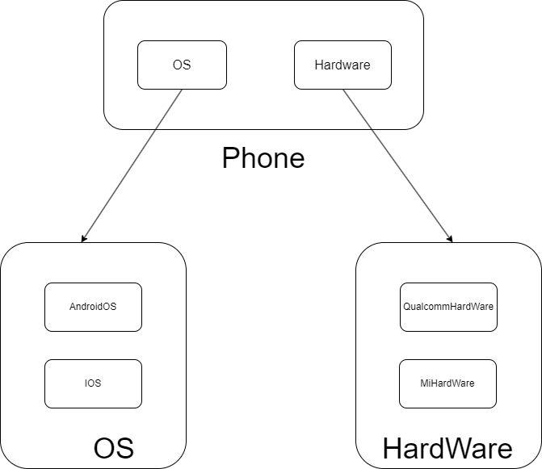

## 简介

设计模式是为了解决软件开发过程中出现的常见问题，可以认为是这些常见问题的解决方案。**设计模式的核心是区分变与不变，让变化更灵活，让不变更稳定。**

## 构造器模式

构造器模式用于解决多个对象实例的变与不变。

构造器模式其实我们几乎每天都在使用。它的一个简单的应用场景就是，假如给一个系统录入用户信息，每个用户都有名字、年龄、职业这三个信息，但是每个信息的值在不同用户之间是不同的。最直接的解决方法就是直接创建用户信息对象

```js
const Jack = {
    name: 'Jack',
    age: 20,
    career: 'student'
}

const Rose = {
    name: 'Rose',
    age: 28,
    career: 'coder'
}
```

但是如果用户的数量多起来，这样创建用户信息对象的方式就显得笨重而繁琐。使用构造器模式将这个过程中的变与不变进行就能改善这种情况。这个过程中，发生变化的是每个用户，他们的name、age、career的值不同；不变的是每个用户都拥有这三个属性。于是我们可以创建一个构造器用于创建用户信息对象：

```js
function User (name, age, career) {
    this.name = name
    this.age = age
    this.career = career
}
```

我们创建了一个构造函数帮助我们创建用户信息。变化的部分也即每个用户信息值的不同，我们将其开放给外部，也就是通过函数参数来接收；不变的部分，即每个用户都有的属性，我们将其封装到构造函数内部。这就是构造器模式最简单的例子，实际上就是我们经常使用的用构造函数来创建对象。

有了User这个构造器，我们只需要在数据库中依次读取用户信息并传入构造器就能实现创建所有用户信息对象的需求。

## 工厂模式

构造器模式是为了解决多个对象实例之间的变与不变，而工厂模式是为了解决多个类的变与不变。

### 简单工厂

还是刚才创建用户的问题。现在需求变得复杂，要求根据每个用户的职业不同分配工作，比如学生需要读书考试，程序员需要写代码修bug。最简单的做法就是在原有构造函数的基础上，加一个参数work，来表示用户的工作。但是这样的方法需要在使用构造函数的时候人为区分每个对象的职业，这不符合设计模式的原则。

我们希望到达的效果是，我只需要无脑把参数传递进去，代码能够自动帮助我们区分用户职业并且分配对应的工作。

实际上，每个用户还是有name、age、career这三个属性，因此User构造器是可以保留的。我们要做的，是在调用User创建用户的时候，先区分用户的职业，然后根据职业分配给每个用户工作。

```js
function User (name, age, career, work) {
    this.name = name
    this.age = age
    this.career = career
    this.work = work
}
```

User构造器只是单纯多加一个参数。在User外部再封装一个构造器

```js
function Factory (name, age, career) {
    let work
    switch (career) {
        case 'student':
            work = ['学习', '考试']
            break
        case 'coder':
            work = ['写代码', '修bug']
            break
        // 其它职业的工作分配
    }
  
    return new User(name, age, career, work)
}
```

可以发现，Factory构造器的使用方法和原完全一样。不变的部分依旧是每个用户都拥有四个属性，变化的部分依旧是每个值取值的不同，只是有一个根据用户职业分配工作的逻辑被我们封装到了一个新的Factory构造器中。

工厂模式的目的，总结起来就是为了在使用构造函数的时候能够无脑传递参数。**而在需要使用构造函数的地方，就可以考虑到是否可以应用工厂模式。**

### 抽象工厂

抽象工厂模式相比简单工厂模式稍微有一些难理解。还是通过例子。假设我要开一个手机制作工厂，一个手机会由操作系统和硬件构成，我不知道具体的手机使用的操作系统和硬件，但是我知道一个手机必须要有这两个部分。因此可以定义一个类：

```js
class MobilePhoneFactory {
    createOS () {
        throw new Error("抽象工厂方法不允许直接调用，你需要将我重写！"); 
    }
  
    createHardWare () {
        throw new Error("抽象工厂方法不允许直接调用，你需要将我重写！");
    }
}
```

这就是一个抽象工厂。可以发现抽象工厂中的方法并不能直接调用，因为会报错。**抽象工厂是用于定义产品的共性的，它并不负责生产具体的产品。** 抽象工厂不创建产品，它负责定义规则，创建产品由具体工厂来实现。

```js
// 具体工厂继承自抽象工厂
class FakeStarFactory extends MobilePhoneFactory {
    createOS() {
        // 提供安卓系统实例
        return new AndroidOS()
    }
    createHardWare() {
        // 提供高通硬件实例
        return new QualcommHardWare()
    }
}
```

创建一个继承自抽象工厂的具体工厂，这个工厂内部会对抽象工厂中定义的方法进行具体的实现。调用这个具体工厂类，我们就能得到一个由安卓系统和高通硬件组成的手机。抽象工厂相当于是定义了一个大的框架，但是不负责生产产品。具体工厂继承抽象工厂，即具体工厂生产产品的时候要满足抽象工厂定义的大框架。

再具体一点到操作系统，操作系统包含多个种类，每个操作系统都拥有控制硬件这一个基本功能。因此可以使用一个**抽象产品**类来对操作系统进行封装。

```js
// 定义操作系统这类产品的抽象产品类
class OS {
    controlHardWare() {
        throw new Error('抽象产品方法不允许直接调用，你需要将我重写！');
    }
}

// 定义具体操作系统的具体产品类
class AndroidOS extends OS {
    controlHardWare() {
        console.log('我会用安卓的方式去操作硬件')
    }
}

class AppleOS extends OS {
    controlHardWare() {
        console.log('我会用🍎的方式去操作硬件')
    }
}
```

和抽象工厂一样，抽象产品类定义大框架，即每一个操作系统都要有控制硬件的功能，但是它并不负责实现这些功能。具体的控制硬件的方法交给具体产品类来实现。当需要生产一台FakeStar手机的时候

```js
// 这是我的手机
const myPhone = new FakeStarFactory()
// 让它拥有操作系统
const myOS = myPhone.createOS()
// 让它拥有硬件
const myHardWare = myPhone.createHardWare()
// 启动操作系统(输出‘我会用安卓的方式去操作硬件’)
myOS.controlHardWare()
// 唤醒硬件(输出‘我会用高通的方式去运转’)
myHardWare.operateByOrder()
```

后续如果需求发生变化，比如需要制造新的手机时，只需要定义一个新的具体工厂类即可。同时更改内部的createOS和createHardWare方法就能实现应用不同的硬件和操作系统。

```js
class newStarFactory extends MobilePhoneFactory {
    createOS() {
        // 操作系统实现代码
    }
    createHardWare() {
        // 硬件实现代码
    }
}
```

最后用一张图片总结一下上面讲的例子：


其中Phone表示最高级的抽象工厂，它定义了所有产品的共性，即产品必须具有的功能。OS和HardWare为抽象产品类，它们定义某一个产品必须具有的共性功能，也可以视为一个小型的抽象工厂。

## 单例模式

**保证一个类始终只有一个实例，并且提供一个全局的访问点，就是单例模式。**

在JavaScript中创建一个类之后，可以通过多次调用new来基于该类创建多个实例，这些实例是独立的，占据单独的内存空间。如果需要实现单例模式，则要求**类具有在创建实例时判断自己是否已经被调用过，并且在非首次调用的时候返回首次调用时创建的实例的能力。**

```js
class SingDog {
    show() {
        console.log('我是单例对象')
    }
  
    static getInstance() {
        // 判断实例是否已经被创建
        if (!SingDog.instance) {
            SingDog.instance = new SingDog()
        }
        return SingDog.instance
    }
}
```

单例模式思想的一个典型的生产应用就是Vuex。在一个Vue应用中，始终只会有一个Store实例，不论在哪一个组件当中，访问到的都是唯一的Store。Vuex的源码并没有直接使用单例模式，但是其设计非常符合单例模式的思想，也即**拦截和判断。**

Vuex创建Store的部分源码，其中并没有上述所说的在类中实现的拦截判断实例是否已经创建的逻辑：

```js
class Store {
  constructor (options = {}) {
    // ...
    this._actions = Object.create(null)
    this._mutations = Object.create(null)
    this._wrappedGetters = Object.create(null)
    this._modulesNamespaceMap = Object.create(null)
    this._subscribers = []
    this._watcherVM = new Vue()

    // 将 this 赋值给 store，这是为了在后续的函数中使用 Store 实例的上下文
    const store = this
    // 将 this 中的 dispatch 和 commit 方法解构出来，以便在后续的函数中使用
    const { dispatch, commit } = this
    // 分别为 dispatch 和 commit 方法绑定上下文
    this.dispatch = function boundDispatch (type, payload) {
      return dispatch.call(store, type, payload)
    }
    this.commit = function boundCommit (type, payload, options) {
      return commit.call(store, type, payload, options)
    }
    // ...
  }
}
```

实际上，这个拦截的逻辑被放在了`Vue.use()`方法中，Vuex需要通过`Vue.use()`方法才能被注入到Vue应用中，而`Vue.use()`实际上是去调用了在Vuex中实现的`install`方法：

```js
let Vue // 这个Vue的作用和楼上的instance作用一样

export function install (_Vue) {
  // 判断传入的Vue实例对象是否已经被install过Vuex插件（是否有了唯一的 store）
  if (Vue && _Vue === Vue) {
    if (process.env.NODE_ENV !== 'production') {
      console.error(
        '[vuex] already installed. Vue.use(Vuex) should be called only once.'
      )
    }
    return
  }
  // 若没有，则为这个Vue实例对象install一个唯一的Vuex
  Vue = _Vue
  // 将Vuex的初始化逻辑写进Vue的钩子函数里
  applyMixin(Vue)
}
```

`install`方法首先会判断一次传入的Vue实例是否已经有了Store，如果已经存在则会报错，不存在则正常执行安装逻辑。

单例模式的核心思想就是拦截实例的创建操作。在真正进行创建实例的操作前，先判断是否已经存在创建过的实例。同时这也要求，在创建实例的时候需要将实例存储在一个类可以访问到的位置，一般来说就是直接挂到类自身上。

关于单例模式的两道经典面试题：

1. 实现一个Storage类，单例模式。

```js
class Storage {
    static getInstance() {
        if (!Storage.instance) {
            Storage.instance = new Storage()
        }
        return Storage.instance
    }
  
    get(key) {
        return localStorage.getItem(key)
    }
  
    set(key, value) {
        return localStorage.setItem(key, value)
    }
}
```

2. 实现一个全局的模态框。

```js
// 闭包的方式实现
const Modal = (function () {
    let modal = null
    return function () {
        if (!modal) {
            modal = document.createElement('div')
            modal.innerHTML = '我是一个全局唯一的Modal'
            modal.id = 'modal'
            modal.style.display = 'none'
            document.body.appendChild(modal)
        }
        return modal
    }
})()
```

## 原型模式

在创建对象时，先找到一个对象作为原型，然后通过**克隆原型对象**的方式创建一个与原型一样的对象，新对象和原型对象公用一套数据和方法，这样的模式称为原型模式。**原型模式不仅是一种设计模式，更是一种编程范式。** 原型模式的核心思想是基于现有对象的属性和方法创建新对象，而无需显式调用类或构造函数。

JavaScript中的`Object.create()`方法是原型模式的天然实现，该方法可以创建一个以指定对象为原型的新对象。需要注意的是，JavaScript中的原型模式和强类型语言（比如Java）中的原型模式是有一定区别的，JavaScript中都是基于原型和原型链来实现的，强类型语言则是通过类来实现。**JavaScript中的class并非真正的类，它只是原型继承的一种语法糖而已。**

面试中经常问到的“实现Java中的克隆模式”或者“使用JavaScript实现原型模式”等问题，实际上是为了考察我们对于原型模式的理解是否到位，即基于现有对象创建新对象。这类问题有一个更加好懂的提问方式，**使用JavaScript实现对象的深拷贝**。关于对象深拷贝，可以参考[这篇博客](https://segmentfault.com/a/1190000016672263#item-7)。

## 装饰器模式

装饰器模式其实跟ES7中实现的装饰器一样，目的是**在不修改原有对象代码的基础上，拓展对象的功能**。

不关注原有逻辑，只关注拓展功能是装饰器模式的核心所在。实际业务开发中在对原有功能进行迭代的时候，装饰器模式非常有用。因为原有功能的逻辑可能是由其他人甚至已经离职的同事编写的，如果需要修改原有代码来实现新功能，就要求我们需要首先理解原有功能的实现逻辑，这是非常费时并且不明智的做法。借助装饰器模式的思想，我们不关注原有功能如何实现，只关心我们需要拓展的新功能。

假设现在有一个原始的车辆类：

```js
class Car {
  constructor() {
    this.description = "Basic car";
  }

  getDescription() {
    return this.description;
  }
}
```

现在我们希望给车辆增加导航功能和跑车外观。最直接的想法是直接在原有的车辆类内部增加新的方法即可，但是如果这个车辆类是一个迭代了非常久的功能，内部的代码实现非常复杂，直接去修改源代码并不明智。借助装饰器模式，我们定义两个装饰器函数：

```js
function addNavigation(car) {
  car.getDescription = function() {
    return car.getDescription() + ', with navigation';
  };
  return car;
}

function addSportsAppearance(car) {
  car.getDescription = function() {
    return car.getDescription() + ', with sports appearance';
  };
  return car;
}
```

接下来，如果我们需要给车添加这些功能，则直接将装饰器函数应用到**车辆类的实例**即可。

```js
let myCar = new Car();
myCar = addNavigation(myCar);
myCar = addSportsAppearance(myCar);

console.log(myCar.getDescription()); // 输出：Basic car, with navigation, with sports appearance
```

前面说过目前ES已经原生支持装饰器语法了，详细的介绍可以看[阮一峰老师的ES6教程](https://es6.ruanyifeng.com/#docs/decorator)。

装饰器模式一个非常经典的生产应用场景就是React的高阶组件。高阶组件本质上是一个函数，接收一个组件作为参数，返回一个经过改造后的组件。高阶组件并不改变原有组件的代码，同时可以对原组件的功能进行扩展。

## 适配器模式

**适配器模式把一个类的接口转换为用户所期望的另一个接口。**

适配器模式其实类似于现实生活中转接线的作用。比如我现在有一条TypeC的数据线，但是电脑只有一个USB的A口。这个时候我们可以买一条转接线，一端通过USB的A口连接电脑，另一端通过TypeC口连接我们的数据线。这里的转接线就是一个适配器。可以说，他把电脑（类）的USB的A口（原有接口）转换为我们需要的TypeC接口（用户期望的接口）。

一个简单的例子，现在`fetch`方法因为其简单快速的请求特性，非常受欢迎。所以公司的程序员小王封装了一个基于`fetch`网络请求库。

```js
class HttpUtils {
    static get (url) {
        return new Promise((resolve, reject) => {
            fetch(url)
                .then(reponse => reponse.json())
                .then(result => resolve(result))
                .catch(error => reject(error))
        })
    }
  
    static post (url) {
        return new Promise((resolve, reject) => {
            fetch(url, {
                method: 'POST',
                headers: {
                    Accept: 'application/json',
                    'Content-Type': 'application/x-www-form-urlencoded'
                },
  
                body: {}
            })
                .then(response => response.json())
                .then(result => {
                    resolve(result)
                })
                .catch(error => {
                    reject(error)
                })
        })
    }
}
```

这个网络请求库只需要在使用的时候传递url以及body参数就可以了。老板觉得小王干的不错，所以交给小王一个艰巨的任务，把公司所有的项目网络请求都使用`fetch`来完成。小王傻了，因为公司有很多的老项目都是使用XMLHttpRequest来完成的，这些请求调用时需要传递参数是这样的：

```js
function Ajax(type, url, data, success, failed){
  
}

// 发送get请求
Ajax('get', url地址, post入参, function(data){
    // 成功的回调逻辑
}, function(error){
    // 失败的回调逻辑
})
```

这下两个请求库的名称不一样而且传递参数的方式也不同。但是了解适配器模式的小王瞬间想到了可以使用适配器模式来解决这个问题，于是他写出了一个适配器：

```js
// Ajax适配器函数，入参与旧接口保持一致
async function AjaxAdapter(type, url, data, success, failed) {
    const type = type.toUpperCase()
    let result
    try {
         // 实际的请求全部由新接口发起
         if(type === 'GET') {
            result = await HttpUtils.get(url) || {}
        } else if(type === 'POST') {
            result = await HttpUtils.post(url, data) || {}
        }
        // 假设请求成功对应的状态码是1
        result.statusCode === 1 && success ? success(result) : failed(result.statusCode)
    } catch(error) {
        // 捕捉网络错误
        if(failed){
            failed(error.statusCode);
        }
    }
}

// 用适配器适配旧的Ajax方法
async function Ajax(type, url, data, success, failed) {
    await AjaxAdapter(type, url, data, success, failed)
}
```

可以发现适配器的特点。首先这个适配器的调用方式和原有的请求的调用方式是一样的，所以用户感知不到。而在适配器内部我们修改了网络请求的逻辑，里面使用的是小王自己封装的网络请求库的接口。这样，新旧接口之间就可以无缝衔接了。

适配器模式一个经典的生产应用就是Axios了，Axios一个令人惊喜的地方就是在浏览器和Node环境都能使用并且使用方式完全一致。这正是得益于Axios内部针对不同的环境采用不同的适配器，以及适配器的入参和返回结果都是完全一致的。也即适配器模式的精髓所在，**用户无感知，** 原来是怎么用的，现在还是怎么用，内部的变化不需要用户关心，也感知不到。

## 代理模式

**通过第三方代理访问对象的方式被称为代理模式。**

代理模式一个经典案例就是VPN。通过VPN访问网络时，实际上是访问到代理服务器，代理服务器请求真实服务器并将真实服务器返回的内容返回给客户端。这种看起来多此一举的操作可以绕过某些特殊的限制。

另一个在代码中的例子就是`Proxy`。通过`new Proxy(target, handler)`的方式可以创建某个目标对象的代理对象，借助代理对象可以对目标对象的访问和属性修改等操作进行拦截，或触发特定逻辑。在Vue3中，响应式的核心正是使用了`Proxy`。在生产实践中常用的几种代理模式有事件代理、虚拟代理、缓存代理和保护代理。

### 事件代理

事件代理一个经典的面试题：一个父元素包含多个子元素，希望每一个子元素在点击时触发相同事件，怎么做是最优解？答案就是事件代理，通过JS事件冒泡的特性，将需要触发的事件绑定到父元素而非子元素上，可以大大减少所需的事件监听器的数量，提高页面性能。

```html
<!DOCTYPE html>
<html lang="en">
<head>
  <meta charset="UTF-8">
  <meta name="viewport" content="width=device-width, initial-scale=1.0">
  <meta http-equiv="X-UA-Compatible" content="ie=edge">
  <title>事件代理</title>
</head>
<body>
  <div id="father">
    <a href="#">链接1号</a>
    <a href="#">链接2号</a>
    <a href="#">链接3号</a>
    <a href="#">链接4号</a>
    <a href="#">链接5号</a>
    <a href="#">链接6号</a>
  </div>
  <script>
      const father = document.getElementById('father')
  
      father.addEventListener('click', function (event) {
          if (event.target.tagName === 'A') {
              event.preventDefault()
              alert(`我是${event.target.innerText}`)
          }
      })
  </script>
</body>
</html>
```

通过事件冒泡，将本应该由子元素触发的事件交给父元素进行代理处理。

### 虚拟代理

虚拟代理是一种用于优化对于昂贵资源的访问的设计模式，以图片预加载为例子，图片预加载技术会首先在目标位置加载一张占位图，然后在目标图片加载完毕之后，使用目标图片代替占位图片。在网络环境不好的情况下，预加载可以避免图片空位长期出现。

```js
// 预加载类 用于获取图片节点同时替换图片src
class Preload {
    constructor (imgNode) {
        this.imgNode = imgNode
    }
  
    setSrc (imgUrl) {
        this.imaNode.src = imgUrl
    }
}

class ProxyImage {
    static LOADING_URL = 'xxxxx'
  
    constructor (targetImage) {
        // targetImage是Preload的实例，是目标图片
        this.targetImage = targetImage
    }
  
    setSrc (targetUrl) {
        this.targetImage.setSrc(ProxyImage.LOADING_URL)
      
        const virtualImage = new Image()
        virtualImage.onload = function () {
            this.targetImage.setSrc(targetUrl)
        }
        virtualImage.src = targetUrl
    }
}

const imgNode = document.querySelector('#myImage'); // 获取真实的图片节点
const targetImage = new PreLoadImage(imgNode); // 创建 PreLoadImage 实例

const proxyImage = new ProxyImage(targetImage)
proxyImage.setSrc('目标图片url')
```

### 缓存代理

缓存代理也是一种性能优化模式。即在调用函数的使用，先根据参数查看是否已经存在过之前计算的结果。没有则计算并缓存结果，有则直接返回缓存结果。缓存代理是一种**空间换时间**的优化策略。在面试的时候遇到过这样的题目：闭包实现一个简单的缓存功能函数， 函数参数相同的情况下，返回上次参数相同时执行的结果。

```js
function cacheFunction(fun, context) {
    const cache = {}
    context = context || this
    return function (...args) {
        const key = Array.prototype.join.call(args, ',')
        if (key in cache) {
            return cache[key]
        }
        return cache[key] = fun.apply(context, args)
    }
}
```

### 保护代理

保护代理就是前文所说的`Proxy`。它可以对某一个对象的访问，属性修改，枚举等等操作进行拦截，从而达到保护的效果。在代理对象内部设置合理的逻辑，就能防止对于目标的恶意操作生效，是一种“保护”措施。
