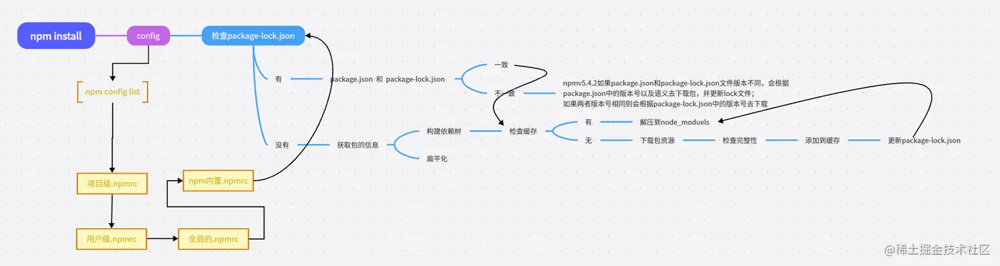
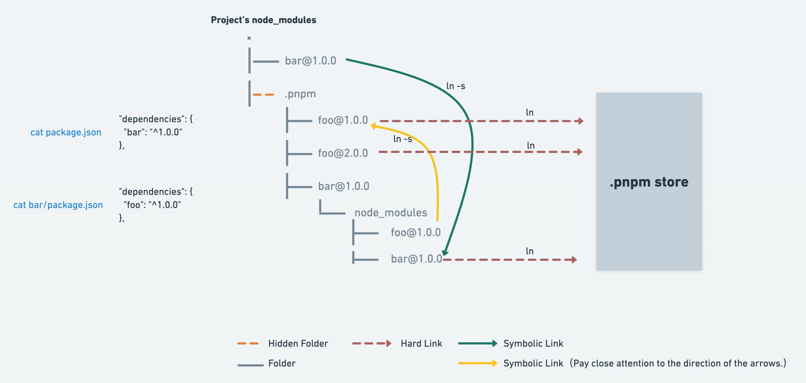

## npm

全程Node Package Manager即Node.js的包管理工具，和Python中的pip是一样的东西，用于下载、安装、管理Node.js中的各种依赖包。使用`npm init`可以生成一个项目的初始化配置文件`package.json`。下面针对这个文件做一个简单的介绍：

```json
{
  "name": "02_package_demo", //项目名称
  "version": "1.0.0", //项目版本
  "description": "", //项目的简单描述
  "main": "index.js", //入口文件
  "scripts": { //命令行配置，对象形式。通过npm run {key}可以运行对应的value中的命令
    "start": "node ./src/main.js",
    "build": "webpack xxx.js"
  },
  "keywords": [], // 关键字，方便在npm仓库中搜索时寻找到这个项目
  "author": "", //项目作者
  "license": "ISC", // 许可证，类似开源协议
  "dependencies": { //项目依赖的库
    "axios": "^0.27.2",
    "dayjs": "^1.11.3",
    "element-plus": "^2.2.6",
    "vue": "^3.2.37"
  },
  "devDependencies": { //项目开发时的依赖，在生产环境下不依赖 npm install的时候加上--save-dev或-D表示开发时依赖
    "babel": "^6.23.0",
    "webpack": "^5.73.0"
  }
}
```

> 版本号由三个部分组成，以`axios 0.27.2`为例。
>
> * 0表示主版本号。做了不向下兼容的`API`修改的时候需要更新。
> * 27表示次版本号。一般是新增了一些向下兼容的功能的时候更新。
> * 2表示修订号。一般是做了一些`bug`修复的时候更新。

另外一个重要的配置文件是`package-lock.json`，其作用时用于锁定依赖包的精确版本号。在多人协作进行开发的时候，这个文件可以保证在不同的开发人员的电脑上，下载安装的依赖包的版本都是一致的。除此之外，这个文件还可以根据生成依赖包的缓存信息，它可以根据依赖包的信息生成对应的key，这样可以避免在同一个项目重复安装同一个版本的依赖。

### npm install原理

npm安装依赖是扁平化的（理想状态下），首先将所有依赖安装到node_modules目录下，然后再处理每个依赖包的依赖，直到处理完整个依赖树。使用的算法是广度优先算法，即先处理完一层的所有依赖包后再处理下一层。关于npm install的安装过程可以参考[满哥的文章](https://juejin.cn/post/7261119531891490877)以及下面这张图：



同时这里还提到了`.npmrc`文件的作用，这个文件包含一些关于npm自身的配置。包括是否使用镜像源和网络代理等，下面是一个`.npmrc`文件的配置例子：

```makefile
# 使用淘宝镜像加速下载
registry=https://registry.npm.taobao.org/

# 设置代理服务器
proxy=http://proxy.example.com:8080

# 设置私有仓库的认证信息
//registry.example.com/:_authToken=YOUR_AUTH_TOKEN

# 设置默认的依赖包版本范围
save-exact=true

# 禁用安全警告
strict-ssl=false

# 设置缓存路径
cache=/path/to/npm/cache

# 配置脚本钩子，在依赖包安装之前和之后需要运行的脚本
preinstall=echo "Running preinstall script"
postinstall=echo "Running postinstall script"
```

### npm run

使用npm run可以运行在package.json的scripts字段中定义的脚本命令，找到脚本命令后会按照下面的顺序搜索可执行文件。

1. 搜索项目的`node_modules/.bin`目录
2. 搜索全局的`node_modules`目录
3. 尝试在环境变量中寻找，如果还没有找到就会报错

在.bin目录下可能会发现同名的可执行文件，一般来说是nodejs为了适配不同操作系统而生成的。

npm run执行脚本其实也存在声明周期，以npm run dev为例：

```makefile
"predev": "node prev.js",
"dev": "node index.js",
"postdev": "node post.js"
```

运行npm run dev命令后，先执行predev，然后才是dev，最后是postdev。使用了这个特性的生产实践比较有名的就是[vue-cli](https://github.com/vuejs/vue-cli/blob/dev/package.json)，可以发现pretest这个脚本会在执行test之前先执行清除命令：

```json
 "scripts": {
    "test": "node --experimental-vm-modules scripts/test.js",
    "pretest": "yarn clean",
    "lint": "eslint --fix packages/**/*.js packages/**/bin/*",
    "lint-without-fix": "eslint packages/**/*.js packages/**/bin/*",
    "check-links": "node scripts/checkLinks.js",
    "clean": "rimraf packages/test/* packages/**/temp/*",
    "clean-e2e": "rimraf /tmp/verdaccio-workspace",
    "sync": "node scripts/syncDeps.js",
    "boot": "node scripts/bootstrap.js",
    "release": "yarn --pure-lockfile && yarn clean && node scripts/release.js",
    "version": "node scripts/genChangelog.js && node scripts/genDocs.js && git add CHANGELOG.md && git add docs",
    "docs": "vitepress dev docs",
    "docs:build": "vitepress build docs",
    "patch-chromedriver": "node scripts/patchChromedriver.js"
  },
```

### npx

npm5.2.0提供的新功能，可以在不全局安装的情况下，执行安装在本地或者远程仓库中的包。在初始化React项目时经常使用的`npx create-react-app`就是使用的这个功能。该功能简单来说也会下载对应的npm包执行，但是结束后会将其删除。npx侧重于执行某个包而不是下载或者卸载，那是npm的工作。

### 发布npm包

可以查看我之前在语雀写的[文章](https://www.yuque.com/xrikis/xlc8cf/ygazi3ztv3dghktg)。补充说明一下发布npm包的好处：

- 跨团队共享代码，方便管理。
- 开源必备，方便他人使用你造好的轮子。
- 增加个人或者团队的影响力。

### 构建npm私服

使用私服的好处：

- 团队内部共享代码，方便开发以及避免重复重复开发。
- 安全性高，私服中的包仅对拥有权限的人开放。
- 提高安装速度，常用的npm包可以缓存到私服中提高下载速度。在没有互联网连接的情况下，依旧可以使用私服下载依赖包。

## pnpm

新型的包管理工具，基于软链接和硬链接以及非扁平化的node_modules目录，相比npm安装速度非常快且更加节省磁盘空间

### 原有包管理工具的痛点

**原有包管理工具最大的痛点其实是依赖包无法复用的问题。**

一般来说，我们的电脑里面不可能永远只开发一个项目。在开发多个项目的时候，每个项目都拥有自己的依赖包，即`node_modules`目录管理的文件。如果说此时多个项目中都依赖了同一个外部工具包，以`axios</span>`这个常见的工具为例。`A B`两个项目都依赖了`axios`，原有的包管理工具的策略是在`A B`两个项目各自的`node_modules`文件夹下都保存一份`axios`的源码，即使它们完全相同。这无疑就造成了磁盘空间的无意义占用。`npm yarn`等包管理工具都存在这个问题。

`pnpm`则将这些依赖包收集起来统一管理，所有项目都可以访问。这样做无疑大大减小了项目的磁盘占用率。除此之外，`pnpm`还拥有高效、安装速度快等优点。

### 硬链接和软链接

#### 硬链接

维基百科定义：****电脑系统中多个文件平等的共享一个文件存储单元****。

电脑中真实的数据都是存储在电脑磁盘中的，而操作系统会对这些数据进行一个抽象和映射。比如我下载了一个视频`xx.mp4`，视频中真实的数据都是存在磁盘中的，而我们在电脑上看见的就是一个名为`xx.mp4`的文件。这个文件和磁盘中对应的数据之间就是建立了硬连接。

以`abc.js`为例，我们在命令行窗口中输入

```plain
mklink /H abc.js abc_hard.js
```

就能在统计目录看到一个`abc_hard.js`文件。此时我们无论修改哪一个文件，其变化都会反映在另一个文件上。本质是因为，虽然在操作系统中表现为两个文件，但是实际上这两个文件访问的都是磁盘中的同一份数据，所以变化才会反映到彼此身上。

这和`js`中引用数据类型的概念很像。

#### 软链接

维基百科定义：****一类特殊的文件，其中包含一条以绝对或者相对路径的形式指向其他文件或目录的引用****。

其实通俗的来说就是电脑上的快捷方式。我们建立快捷方式，就是为了能够快速访问某一个目录下的文件，快捷方式内部仅仅只是一个引用，指向某个文件。****软连接不能进行编辑****。下面的命令可以建立一个软链接

```plain
mklink abc_soft.js abc.js
```

可以发现`abc_soft.js`文件左下角有一个箭头，表明它是一个快捷方式，指向某个文件。

### 原理

使用`pnpm`（全称`performant npm`）安转依赖包的时候，`pnpm`会将这些依赖包存放到一个统一的位置。磁盘中此时保存了一份依赖包的数据。

* 若多个项目依赖了同一个版本的依赖包，则会直接在项目和磁盘文件之间建立硬连接，而不是重新下载保存依赖包。这自然比传统的包管理更加高效以及节约磁盘空间。
* 若依赖了同一个依赖包的不同版本。`pnpm`只会保存那些不同版本之间发生了变化的文件，没有变化的文件只会保存一份。

### 非扁平的node_modules目录

> 扁平化目录？

以`axios`为例，如果使用`npm/yarn`安装`axios`会发现，`node_modules`目录下除了`axios`的文件夹，还有一些`axios`本身依赖的包，并且这些被依赖的包和`axios`出于同一个层级的目录中。这就是扁平化目录。这样我们在项目中就能直接使用`axios`所依赖的包，比如`formdata`，即使我们没有安装它。这样的的做法是不够规范的。因此`pnpm`建立的`node_modules`是非扁平化的，以下图为例。



项目中依赖了`bar`，那么`node_modules`中只有`bar`这个文件夹。这个文件夹是一个软连接，连接到同级的`.pnpm`目录下的`bar`文件，这个文件就是一个硬连接，连接到磁盘中的数据。而当`bar`中依赖了其他比如`foo`这个库的时候，会在`bar`的`node_modules`目录下又建立一个软连接，连接到`.pnpm`下的`foo`文件，里面的硬连接会指向磁盘中存储了`foo`数据的位置。

这样做，即使`bar`这个库依赖了`foo`这个库，我们也不能直接在项目中使用`foo`而必须重新安装。增加了目录结构的复杂度但是规范了依赖库的使用。

### 常见命令


| **npm**           | **pnpm**         |
| ----------------- | ---------------- |
| **npm install**   | **pnpm install** |
| **npm install**   | **pnpm add**     |
| **npm uninstall** | **pnpm remove**  |
| **npm run**       | **pnpm**         |

**另外两个较为重要的命令。**

* `pnpm store path`。查看`pnpm`真正和磁盘建立硬连接的目录。
* `pnpm store prune`。裁剪，`store`中一些长时间没有使用的依赖包会被这个操作擦除掉。可以隔一段时间执行一次，缓解磁盘压力，但是不要执行得太过频繁。
