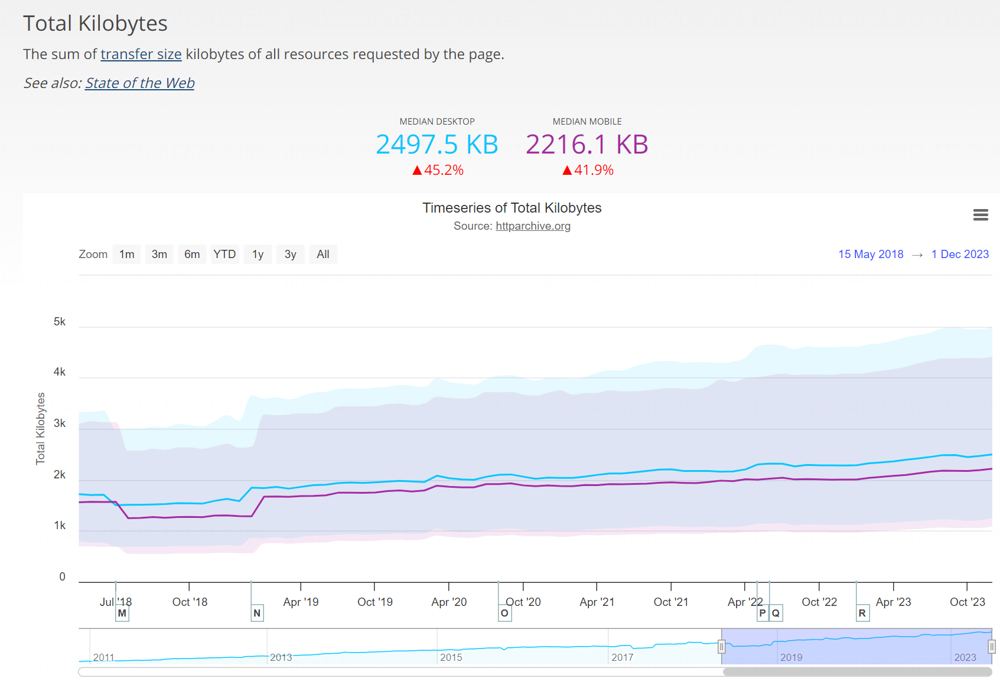
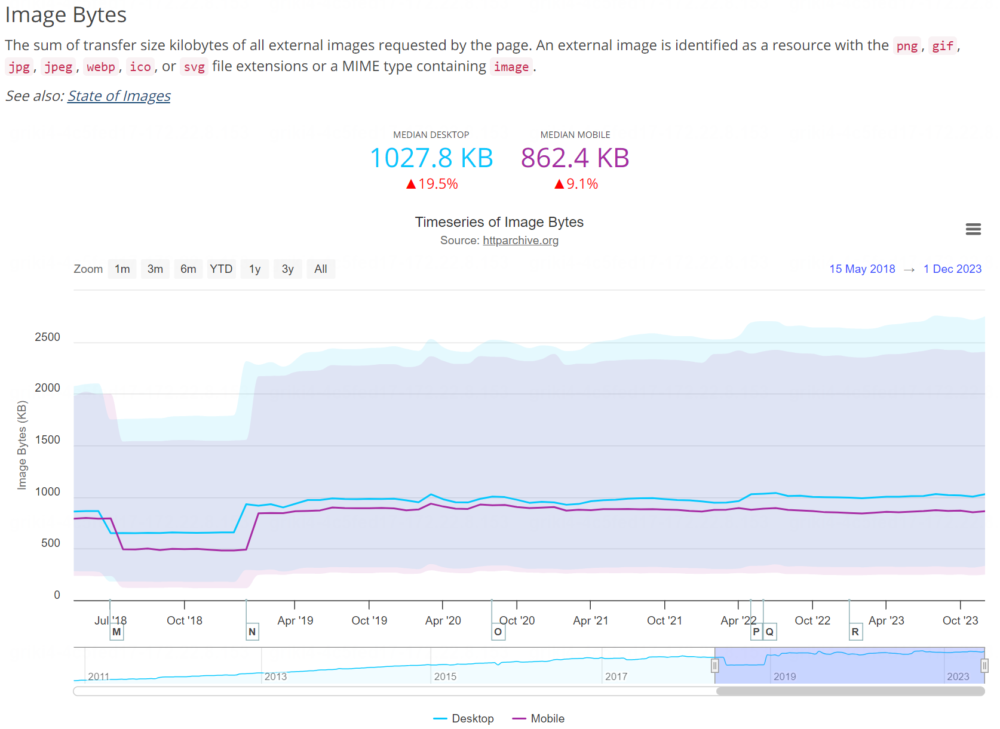

## 前端性能优化

从输入URL到页面加载完成发生了什么？ 这是一道经典的面试题目，而前端需要做的性能优化也是针对这个过程中的五个步骤。

1. DNS解析
2. 建立TCP连接
3. 发送HTTP请求
4. 接收HTTP响应
5. 渲染页面

前两个步骤优化作为前端开发者能做的事情有限，但是后三个步骤则是前端性能优化中的重点。按类型可以分为网络相关的性能优化和渲染相关的性能优化。本篇主要讨论网络性能优化，前端能做的对于网络相关的优化主要有两点：

- 减少网络请求的数量。
- 减少单次网络请求花费的时间。

## webpack构建优化

现代前端应用基本都是基于框架搭建，其内部一般来说都包含非常多的文件。如果在项目投入使用时，依旧按照我们在开发时编写的代码的零碎程度的话，客户浏览器无疑需要进行数量极大的网络请求才能将完整的页面展示给客户。所以为了避免这个问题，我们需要webpack这样的构建工具来进行“打包”。

“打包”优化也可以细分为两个部分，**打包过程的速度优化**和**打包产物的体积优化**。

### 打包过程速度优化

#### 约束loader的作用范围

loader是webpack打包过程中非常重要的角色，充当“翻译官”的作用。但是对于`node_modules`这样的文件，大部分的loader都没有必要作用于它们，因为不仅花费时间多而且也没有多大意义。所以在配置laoder时可以使用exclude来让某些文件处于loader的作用范围之外：

```js
module: {
  rules: [
    {
      test: /\.js$/,
      exclude: /node_modules/,
      use: {
        loader: 'babel-loader',
        options: {
          presets: ['@babel/preset-env']
        }
      }
    }
  ]
}
```

#### 第三方库单独打包

第三方库在项目运行时是不可或缺的，但是它们不应该和项目本地文件一样被打包进产物，而是在项目运行的时候从外部获取。一种方法是使用`externals`配置将指定的第三方库排除在打包产物之外，这些第三方库被称为扩展依赖（externals dependencies）。

```js
module.exports = {
  //...
  externals: {
    react: 'react',
  },
}
```

另一种处理第三方库的方法是使用[`DllPlugin`插件](https://www.webpackjs.com/plugins/dll-plugin#root)第三方库打包进单独的文件，只有第三方库的版本发生变化的时候才会进行重新打包。

#### 多进程打包

webpack默认情况下是单线程运行的，这是基于Node.js的架构带来的限制。而多进程打包可以有效利用现代CPU的多核架构，加快构建速度。目前webpack官方推荐的开启多进程打包的方式是使用`thread-loader`，使用方法和传统的loader一样。

```js
module.exports = {
  module: {
    rules: [
      {
        test: /\.js$/,
        use: ["thread-loader", "babel-loader", "eslint-loader"],
      },
    ],
  },
}
```

对于项目体积较大的情况来说，多进程打包可以有效提高构建速度。**不过，进程自身的创建和销毁本身就是非常耗时的工作，因此使用多进程打包之前需要珍重考虑。**

#### 持久化缓存

将首次打包的产物进行缓存，二次构建时只对必要的文件进行重新打包构建。

```js
module.exports = {
    //...
    cache: {
        type: 'filesystem'
    },
    //...
}
```

### 打包产物体积优化

#### Tree-Shaking

基于ES6提供的`import/export`语法可以在编译时分析出没有使用到的死代码并进行擦除，减小产物体积。

#### ScopeHoisting

将模块间的调用关系转为更加直接的变量引用，减少函数声明和闭包包装的代码量。

比如A文件导出了一个函数，B文件使用了这个函数。默认情况webpack会分别将两个文件使用单独的闭包进行包装生成最终的产物。但是开启ScopeHoisting之后就会仅仅使用一个闭包来包装最终产物。

```js
// main.js
export default "hello leo~";

// index.js
import str from "./main.js";
```

之前的产物：

```js
[
  (function (module, __webpack_exports__, __webpack_require__) {
    var __WEBPACK_IMPORTED_MODULE_0__util_js__ = __webpack_require__(1);
    console.log(__WEBPACK_IMPORTED_MODULE_0__util_js__["a"]);
  }),
  (function (module, __webpack_exports__, __webpack_require__) {
    __webpack_exports__["a"] = ('hello leo~');
  })
]
```

之后的产物：

```js
[
  (function (module, __webpack_exports__, __webpack_require__) {
    var util = ('hello leo~');
    console.log(util);
  })
]
```

#### 代码压缩

使用Uglify-js或者TerserPlugin一类的压缩工具，可以将项目中代码进行压缩。

#### 产物拆分

上文提到的将第三方库单独打包进一个文件的方法就是一种产物拆分方式。Code-Splitting也是一种产物拆分的方式，它会按照入口文件、异步加载、运行时的方式将产物拆分为更小的chunk，最终用户在使用项目时就不必等待一个庞大的打包文件完全加载完成才能看见项目了。

产物拆分的另一个又是就是避免缓存过快失效。因为项目全部打包成一个文件，项目中一个文件的微小变化都可能引起整个打包产物的缓存失效。拆分成多个产物则只需要更新对应chunk的缓存即可。

## Gzip压缩

Gzip压缩是一种内置到网页服务器和浏览器的改善网络传输速率和带宽利用率的方法，服务端在发送文件之前将文件进行压缩，客户端收到文件后进行解压。这个过程中需要客户端做的就是提前告知服务器自己支持的雅座方法，比如Gzip或Deflate。前端开启Gzip只需要在请求头中加入

```makefile
accept-encoding:gzip
```

## 图片优化

图片是现代web网站中最重要的环节，其在网站文件中占据的比例也是相当大的。下面的图片是[HTTP Archive](https://httparchive.org/reports/page-weight#bytesImg)网站在2023年底统计的web资源的请求体积以及其中图片的体积。





所以说，图片的优化是网站性能优化至关重要的一点。而且图片和传统的web资源（HTML CSS JS）相比，它是用户能够直接感知到的，因此对于图片的优化不能牺牲掉太多的图片质量。目前常用的针对图片的优化主要是更改图片的格式，主要有下面几种：

1.JPG/JPEG。有损压缩格式，体积小，但是不支持透明度。对于较大的、色彩比较丰富的图片非常适用，如网站背景图、轮播图等。

2.PNG-8/PNG-24。无损压缩格式，体积大，支持透明度。对于页面LOGO、图标等较小的图片适用。

3.SVG。可编程矢量图形，体积小、不失真，但是有一定的学习代价。同时SVG的渲染成本也比较高。

4.Base64编码。将一些比较小的图片直接编码进HTML中，减少网络请求的次数。

5.WEBP。Google推出的新型图片格式，兼容无损压缩和有损压缩，支持透明度，支持动图。但是目前的浏览器兼容性还有待考量。

6*.AVIF。新的图片格式，基于AV1视频编解码器，在压缩效率和图片质量方面相比WEBP更加优秀。但是浏览器兼容性比WEBP要更差，因为它提出的时间更晚。
