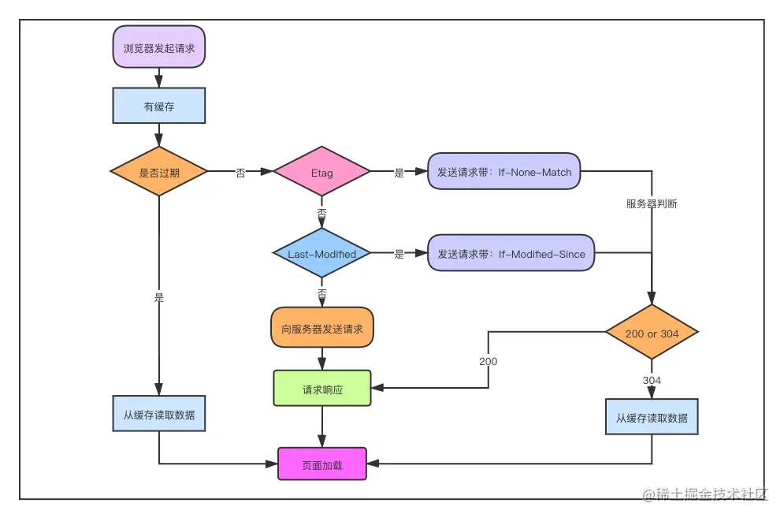

## 缓存策略

谈及缓存作为前端开发者了解的最多的就是HTTP缓存。实际上的缓存机制还包括Memory Cache、Server Worker Cache、Push Cache等，不过HTTP缓存是最重要也是最常见的缓存机制，所以对它的了解也是最重要的。

### HTTP缓存

这是我们最为熟悉的缓存机制，Expires和Cache-Control等字段都是HTTP缓存相关的。HTTP缓存主要分为强缓存和协商缓存。

#### 强缓存

使用强缓存，在资源的有效期内，直接读取缓存中的资源，不必向服务器发起请求。

在http响应头中设置Expires或者Cache-Control属性可以启用强缓存策略。

（1）Expires

服务器在响应头中添加一个Expires属性，表示资源的过期时间，主要在http1.0中使用。Expires中设置的时间是绝对时间，是服务器的时间，因此如果浏览器和服务器的时间不一致，或者用户修改了浏览器的时间，采用Expires的强缓存策略就会出现问题。

```makefile
Expires: Sun, 19 Jun 2022 09:50:10 GMT
```

（2）Cache-Control

为了解决Expires的问题，http1.1中提出了新的头部字段Cache-Control，用于实现对强缓存机制更加精确有效的控制。

```makefile
Cache-Control: max-age=300
```

除了max-age，Cache-Control的可选字段还有：

- public：代表资源可以被任何对象缓存，无论是客户端还是代理服务器。
- private：资源只可以被用户浏览器缓存，不允许任何代理服务器缓存。一些包含用户隐私信息的HTML都应该设置该选项。
- no-cache：禁止在未经过和服务器询问的情况下使用缓存资源，也即绕过强缓存。
- no-store：禁止任何形式的缓存，每次请求都是直接向服务器请求并下载完整的资源。
- max-age：缓存过期时间，注意它记录的是浏览器发送请求与它上一次接受到服务器返回资源之间的时间差，比绝对时间更加精准。
- s-maxage：适用于共享缓存，用于管理在代理服务器上的缓存。
- max-stale：客户端愿意接收过期的资源，只要不超过规定的时间限制。

**如果Expires和Cache-Control两个字段同时出现，Cache-Control的优先级更高。**

#### 协商缓存

协商缓存是强缓存没有命中的时候启用的，首先会创建一个请求发送到服务器来确认资源是否改变，没有改变则返回304，浏览器读取缓存资源，否则向浏览器返回修改后的资源。

在http头部设置Etag和Last-Modified可以启用协商缓存。

（1）Last-Modified

Last-Modifined的属性是浏览器所请求的资源最后一次发生变换的时间，这是由服务器所记录的。触发协商缓存，浏览器将他接收的资源的Last-Modified值放入请求头中的if-Modified-Since属性中，服务器对比对应资源的Last-Modified，一致则返回304，浏览器去读取本地缓存，否则则返回修改后的资源以及新的Last-Modified。

但是Last-Modified的精度只能到秒，如果资源在1秒内被连续修改很多次，这个方法就会有问题了。并且客户端和服务端的时间不一致也会导致缓存问题。

（2）Etag

Etag是为了解决Last-Modified的精确度不够高的问题而出现的。Etag是资源的唯一标识，只要资源改变就会改变，无论是在多短的时间内完成。触发协商缓存，浏览器在请求头中设置if-None-Match属性，值为上一次服务器响应资源的Etag值，浏览器对比请求头中的Etag和对应资源的Etag决定返回结果。

如果同时设置Etag和Last-Modified，Etag的优先级更高，主要处于几个方面的考虑。

● 资源周期性修改但是内容不改变，此时我们不希望浏览器认为这个资源该变了
● 某些服务器无法准确获取资源修改的具体时间
● Last-Modified对于秒级以上的文件修改速度无法准确判断

这也并不是说Etag就是最优解，因为Etag的计算是需要耗费服务器的资源的，如果考虑负载均衡使用多个服务器的时候，相同资源在不同服务器上的Etag是不同的，此时就最好不要设置Etag了。

最后用一张在[掘金](https://juejin.cn/post/6916157109906341902#heading-22)上找到的图片解释一下HTTP缓存的流程：


### Memory Cache

内存缓存。直接从内存中取用缓存资源，是生效最早的一类缓存。但是只有一些如base64编码的图片，体积较小的js、css文件才能使用内存缓存，毕竟内存虽然快，但是内存资源很宝贵，不能随意取用。

### Server Woker Cache

独立于浏览器窗口之外的一种缓存机制。

### Push Cache

HTTP2在Server Push阶段生效的缓存。在上述所有的缓存策略都没有命中的情况下才会生效，存在于会话阶段的一种缓存。

## 本地存储优化

将一些重要数据直接存储在本地也是一种性能优化的选择，常见的本地存储策略包括Cookie、Web Storage、IndexDB等等。

### Cookie

cookie是服务器向用户浏览器发送的一小块数据，保存在用户的电脑中，cookie会在下一次浏览器向同一个服务器发送请求的时候随请求一起被发送至服务器。使用它可以告知服务器两次请求是否来自同一个浏览器，可以实现保持用户登录状态等功能。

#### 创建cookie

**服务器收到**`http`请求后，在响应头中添加`Set-Cookie`选项并添加信息。cookie一般是是以键值对的形式存在，比如下面这个响应头。

```makefile
HTTP/1.0 200 OK
Content-type: text/html
Set-Cookie: yummy_cookie=choco
Set-Cookie: tasty_cookie=strawberry

[页面内容]
```

之后，如果浏览器再次向该服务器发起请求，则会在请求头中附带上cookie信息。

```makefile
GET /sample_page.html HTTP/1.1
Host: www.example.org
Cookie: yummy_cookie=choco; tasty_cookie=strawberry
```

#### cookie生命周期

* 默认情况下，浏览器关闭后cookie就会被删除，这种情况下我们没有指定过期时间（`expires`）或者说是（`Max-Age`）。某些包含会话回复功能的浏览器会保存这种cookie，延长它的生命周期。
* 通过指定过期时间，可以长久的保存cookie。****将cookie的过期时间设定为过去可以立即删除cookie****。

下面就是一个设定了过期时间的cookie。cookie的过期时间需要设置为GMT格式。

```makefile
Set-Cookie: id=a3fWa; Expires=Mon, 3 Oct 2022 07:28:00 GMT;
```

#### 限制访问

**为保证cookie在传输过程中的安全性，可以使用**`Secure`和`HttpOnly`属性。

`Secure</span>`属性可以让cookie只经过被https加密后的请求进行发送。但也并非绝对安全的措施。

`HttpOnly`属性可以让JavaScript的`Document.cookie`API无法访问cookie信息，对于保持和服务端对话的cookie来说，没有必要让将它们的信息暴露给JavaScript代码，这样做还可以防范XSS（跨站点脚本攻击）。

比如：

```makefile
Set-Cookie: id=a3fWa; Expires=Mon, 3 Oct 2022 07:28:00 GMT; Secure; HttpOnly
```

#### 作用域

**作用域是设置可以向哪些URL发送cookie的选项。通过**`Domain`和`path`属性来进行设置

`Domain`指定哪些主机可以接收cookie，如果不指定则默认只对其本身有效，子域名均不可读取cookie。指定之后，则其下的所有子域名都可以接收cookie。

`path`使用`/`进行路径分割。如果设置`path = /doc`则下面所有地址都可以接收cookie

* `/doc`
* `doc/Web`
* `doc/Web/http`

#### cookie的特性和使用场景

特性：

* cookie创建成功后名称无法再修改。
* cookie无法跨域名，这个在cookie的定义的时候已经说明了，这是符合cookie的本意的。
* 同一域名下不能设置超过20个cookie，每个cookie的大小不能超过4kb。

如果非要跨域名共享cookie，可以使用Nginx反向代理（正向代理代理客户端，反向代理则代理服务器），或者登录一个网站后向另一网站写cookie。

使用场景：

* 保持用户登录状态
* 统计页面点击次数

Cookie虽然好用，但是过小的存储空间以及每次都会随着请求发送（有时候我们请求服务器可能只是获取一些像logo一样的资源，不需要携带Cookie，但是浏览器还是会默认带上Cookie，这无疑会导致大量的性能浪费）的特性还是限制了我们对于本地存储的期待，因此Web Storage出现了。

### Web Storage

#### LocalStorage

当数据量较大且不需要频繁在浏览器和服务器之间来往的时候，就可以使用`localStorage`。

`<span class="ne-text">localStorage</span>`的出现解决了cookie存储数据的许多难点

* 大小限制为5MB，比cookie容量大，能够存储更多的信息。
* 直接存储在本地，除非用户主动清理否则一直有效。
* 仅在本地存储，不会在每次发送请求时被携带。

当然也有一些问题。

* 受到同源策略的限制。必须是同一协议、域名和端口下的站点才能访问。
* 浏览器兼容问题，IE8以下不兼容。（因为是HMLT5提出的新规范，IE的时代已经结束咧！）
* 隐私模式下的浏览器无法读取。

常用的API：

```js
//保存数据
localStorage.setItem('name', 'value')
//读取数据
let data = localStorage.getItem('name')
//删除数据
localStorage.removeItem('name')
//清除所有数据
localStorage.clear()
//获取指定索引值数据
localStorage.key(index)
```

#### SessionStorage

`sessionStorage`是和`localStorge`一起提出来的客户端存储策略。

`sessionStorage`和`localStorage`的最大的不同之处在于“短命”。虽然二者都是在本地存储数据，但是一旦页面或者浏览器关闭，`sessionStorage`的数据就会被清除。如果是因为浏览器崩溃而关闭的页面的话，它还可以恢复页面，但这得取决于浏览器是否支持。

`sessionStorage`也受到同源策略的限制，并且附加上一条更加严格的限制，必须是**同一浏览器下的同一个页面**才能共享`sessionStorage`下的数据。

`sessionStorage`和`localStorage`的API基本相同。

应用场景：由于是临时会话信息存储，所以经常用来保存网站的游客登录或者浏览信息。

### indexDB

在浏览器运行的事务性数据库，既然是数据库，存储的数据容量一般没有限制。不过目前接触到的应用场景比较少，后续如果有机会在生产实践中接触到可以详细了解一下。
