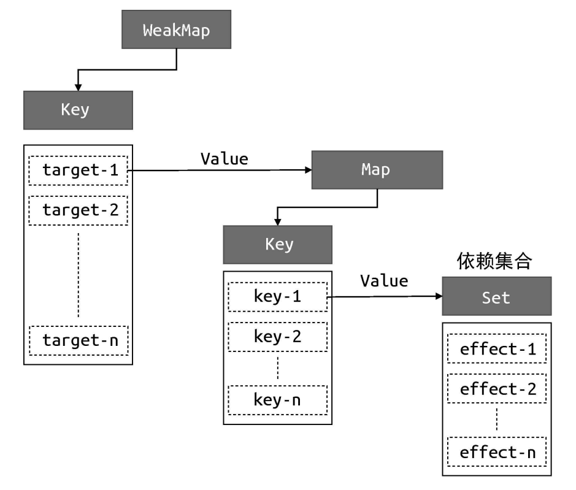
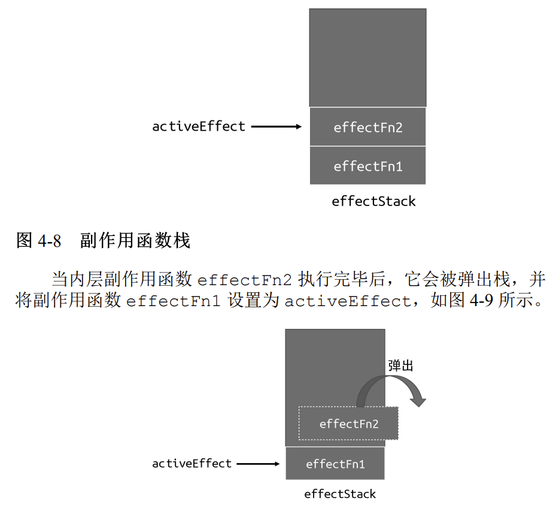

## 响应式系统的作用与实现

`Vue3`的响应式系统的实现核心就是就是两点。
- 依赖收集
- 派发更新

依赖收集是在读取数据阶段发生的。假如一个`effect`函数读取了某一个对象的属性，通过给这个对象设置`Proxy`
代理并且设置`getter`配置，可以知道这个函数并且将它收集到某个地方。也就是依赖收集。

派发更新是指当对象的某个属性发生变化时（通过`Proxy`设置`setter`选项来实现属性值变化监听），将这个属性收集到的依赖（`effect`函数）取出来依次执行。
执行时这些函数会读取新的属性值并执行相应操作，也就是派发更新操作。

具体`Vue`中关于实现依赖收集的数据结构如下所示：

简单解释一下这个结构。首先有一个`WeakMap`，它的`key`是`target`，`target`是我们代理的对象，比如
`Proxy`代理`data`的时候，`data`里面可能有很多对象，`target`代表的就是他们。

**使用`WeakMap`的原因是，弱引用的特性可以做到`target`不再被引用时能够正确的被垃圾回收机制回收。**
毕竟如果原对象都不存在了，那么对于原对象的代理自然也没有必要了。

然后是每个`target`的值，是对象的每个属性，也就是图中的`key`。`key`的值是一个`Set`结构，类似数组，这个里面就是响应式的主角，
被作为依赖收集的`effect`函数。

**之所以每个`key`都需要有自己的`Set`是因为希望能够准确定位哪一个属性发生了变化。而不是把所有属性的
`effect`函数都取出来执行，这显示不是明智的做法。**

## 及时清除无效依赖

上述通过`Proxy`的`getter`和`setter`实现的响应式系统看上去比较完善了，但是还存在一个问题。
比如一个`effect`函数在后续的使用过程中，原先可能读取了一个属性，但是后续又不读取了，例如：
```javascript
const data = { ok: true, text: 'hello world' }
const obj = new Proxy(data, { /* ... */ })

effect(function effectFn() {
    document.body.innerText = obj.ok ? obj.text : 'not'
})
```
`ok`属性如果变为`false`则`effectFn`就不会读取`obj.text`属性了，但是之前他已经作为依赖被收集
到了`obj.text`的依赖中。后续`obj.text`属性变换还是会引起`effectFn`函数执行，这是不必要的性能消耗。
解决这个问题的方法是：
**每次执行`effect`函数之前，把它从所有的集合中先移除然后在执行。**
因为`effect`重新执行时又会读取新数据，重新触发依赖收集。同时还可以保证那些无效的依赖可以即使被清除。

要做到这一点，在`effect`函数当中我们也需要知道，它被作为依赖收集到了哪些`key`的依赖集合中。所以在`Proxy`
收集依赖时，除了将`effect`函数收集起来，还应该调用每个`effect`中的某个方法，将依赖集合自身添加到`effect`
函数中保存依赖集合的数据结构。

添加了无效依赖清除功能之后，响应式系统的简易代码如下：
```javascript
//全局的WeakMap
const bucket = new WeakMap()

//设置代理
const obj = new Proxy(data, {
    get(target, key){
        //activeEffect就是存储effect函数的临时变量
        //effect函数内部首先会进行一个清除操作，然后执行真正的副作用函数。
        if(!activeEffect) return target[key] 
        let depsMap = bucket[target]
        //没有target代理
        if(!depsMap) {
            bucket.set(target, (depsMap = new Map()))
        }
        //定位属性
        let deps = depsMap.get(key)
        if(!deps) {
            deps.set(key, (deps = new Set()))
        }
        //收集依赖
        deps.add(activeEffect)
        //在effect函数的deps中添加当前的deps
        activeEffect.deps.push(deps)
        return target[key]
    },
    set(target, key, newVal){
        //修改属性值
        target[key] = newVal
        //取出effect函数依次执行
        const depsMap = bucket.get(target)
        if(!depsMap) return
        const effects = depsMap.get(key)
        effects && effects.forEach(fn => fn())
    }
})
```
这里也简单贴一下`activeEffect`的代码
```javascript
let activeEffect
function effect(fn) {
    const effectFn = () => {
        //cleanup从依赖中清除自己
        cleanup()
        activeEffect = effectFn
        fn()
    }
    //存储deps的数据结构
    effectFn.deps = []
    effectFn()
}

function cleanup () {
    for (let i = 0; i < effectFn.deps.length; i++) {
        // deps 是依赖集合
        const deps = effectFn.deps[i]
        // 将 effectFn 从依赖集合中移除
        deps.delete(effectFn)
        }
    // 最后需要重置 effectFn.deps 数组
    effectFn.deps.length = 0
}
```
总结就是：`deps`和`effect`两者是相互知根知底的。`deps`知道自己收集了哪些依赖，`effect`也知道自己被
哪些`deps`当做依赖收集了。

## 嵌套的effect

`effect`或者说`wathcer`的嵌套情况十分普遍。最简单的一个父组件中的子组件，就是`effect`的嵌套。

解决嵌套的依赖收集也很简单，`activeEffect`仍然指向当前`effectFn`，只是全局添加一个栈结构来保证
嵌套发生时也能进行依赖收集。如图:

依赖收集的流程如下：

1. `activeEffect`指向当前准备执行的`effectFn`，并将`effectFn`入栈。
2. 执行`effectFn`。
3. 将`effectFn`弹出栈，并将`activeEffect`指向栈顶元素。

显然，当`effectFn`发生嵌套时上述流程重复执行，保证了依赖的正确收集。

## 调度执行

这一步涉及到了`Vue`的异步更新策略，后续写`nextTick`相关的文章时会详细说明。现在只需要记住，
`Vue`中存在着调度器，可以决定`effect`函数的执行时机和次数等。

## computed实现原理
看过源码都知道`computed`中两个重要的配置，`lazy`和`dirty`。两者扮演了不同的角色，分别说明。

### lazy
**`lazy`配置的作用是让计算属性默认懒执行，即被读取时才会执行。**

通过调度器传入`lazy`配置，在计算属性的`effectFn`中进行的流程和普通的`effectFn`会稍微不同。首先，真正的副作用函数的执行结果会被当做`effectFn`的返回值；其次，如果检测到`lazy`配置为`true`，则会返回
`effectFn`函数而不是直接执行它。然后就是，执行计算属性得到的是一个对象，只有读取了这个对象里面的值的
时候，`effectFn`函数才会被执行。`computed`的代码如下：
```javascript
function computed(getter) {
    const effectFn = effect(getter, {lazy:true})
    
    const obj = {
        get value() {
            return effectFn()
        }
    }
    return obj
}
```
也即只有真正读取了`obj.value`的时候`effectFn`才会执行，它内部的读取属性、依赖收集等操作才会执行。
这就是为什么说计算属性是默认懒执行的。

### dirty

**`dirty`赋予了计算属性缓存。**

代码也很简单，在上面代码的基础上修改
```javascript
function computed(getter) {
    let value
    let dirty = true
    const effectFn = effect(getter, {lazy:true})
    
    const obj = {
        get value() {
            //dirty为true才会重新计算
            if(dirty) {
                value = effectFn()
                return value
            }
            //否则直接返回缓存值
            return value
        }
    }
    return obj
}
```
计算属性的懒执行和缓存都是非常出色的性能优化方式，可以较为有效的避免性能浪费。我想这也是为什么官方
文档里面也建议可以多使用计算属性吧。

PS：计算属性的懒执行在依赖收集时会出现问题，需要手动进行依赖收集以及更新派发。

## watch实现原理

`watch`的实现实际上就是对`effect`的简单封装。使用时可以传入函数也可以传入一个对象，`Vue`内部会自动
进行判断，然后将其封装为一个`getter`函数。
```javascript
getter = () => fn || () => traverse() 
//traverse函数会读取用户传入的对象的属性，触发依赖收集
```
之后如果`watch`的属性的值变化，就会触发用户传入的回调函数（这是调度器实现的。）

### 获取oldValue newValue

新值很好获取，直接在数据变化时重新读取即可。`oldValue`的获取则是依赖于`lazy`配置。
在用户使用`watch`的时候，使用`lazy`手动执行一次`effectFn`获取第一次执行的值，后续数据变化时更新即可。
```javascript
function watch(source, cb) {
    let getter
    if (typeof source === 'function') {
        getter = source
    } else {
        getter = () => traverse(source)
    }
    // 定义旧值与新值
    let oldValue, newValue
    // 使用 effect 注册副作用函数时，开启 lazy 选项，并把返回值存储到
    const effectFn = effect(
        () => getter(),
        {
            lazy: true,
            scheduler() {
                // 在 scheduler 中重新执行副作用函数，得到的是新值
                newValue = effectFn()
                // 将旧值和新值作为回调函数的参数
                cb(newValue, oldValue)
                // 更新旧值，不然下一次会得到错误的旧值
                oldValue = newValue
            }
        }
    )
    // 手动调用副作用函数，拿到的值就是旧值
    oldValue = effectFn()
}
```
### 立即执行watch

配置`immediate`选项可以立即执行一次用户回调，这里逻辑也并不复杂，只需要进行一个简单的判断。
判断用户如果传入了`immediate`选项，上面的`scheduler`函数就立马执行。

## 经典面试题：computed和watch的区别？
- `computed`默认懒执行，即被读取时才会执行。并且这个懒执行是源码层面的，不可更改。`watch`则在数据变化时执行，并且可以通过`immediate`选项来设置立即执行。
- `computed`有缓存，`dirty`的存在让每一次读取计算属性时都会查看缓存是否生效。
- 同步异步问题。`computed`依赖其他值得到结果，不能处理异步。但`watch`在数据变化时就执行，可以处理异步。

